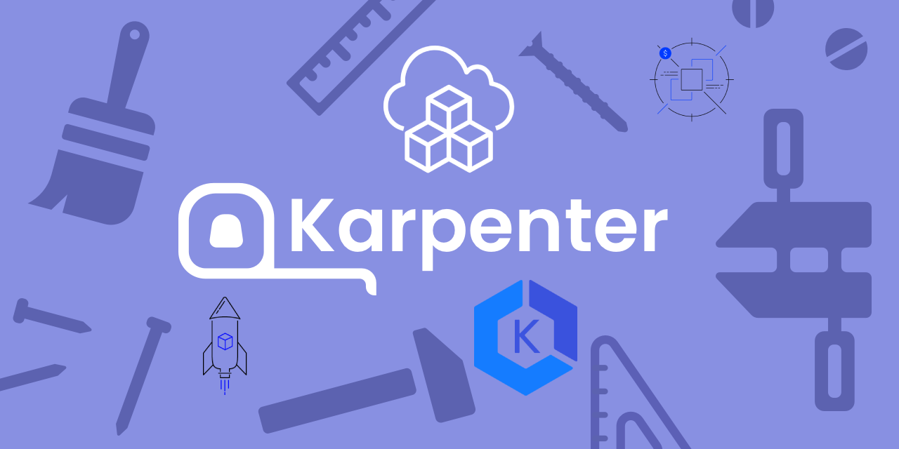
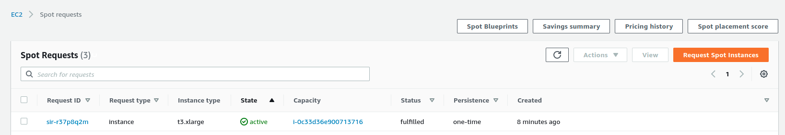
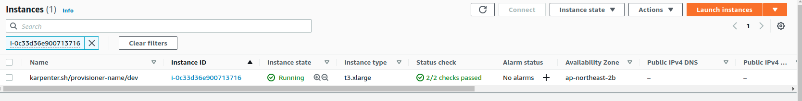

<p align="center">
  <a href="https://dev.to/vumdao">
    
  </a>
</p>
<h1 align="center">
  <div><b>AWS Karpenter Hands-on</b></div>
</h1>

## Abstract
- [Karpenter](https://karpenter.sh/) - Just-in-time Nodes for Any Kubernetes Cluster. It is one of Node-based autoscaling (adding or removing nodes as needed) beyond [cluster autoscaler](https://github.com/kubernetes/autoscaler/tree/master/cluster-autoscaler).
- What does this post provides?
  - Hands on installing karpenter on EKS Cluster
  - Provide permission for Karpenter to create AWS resources through IAM for service account (IRSA)
  - Create sample karpenter provisioner to test scaling-out and scaling down nodes by karpenter
  - Handling Spot interruption using AWS Node termination handler
  - Finally what Karpenter improvements vs cluster autoscaler.

## Table Of Contents
 * [Pre-requisite](#Pre-requisite)
 * [Create karpenter service account](#Create-karpenter-service-account)
 * [Install karpenter using helm chart](#Install-karpenter-using-helm-chart)
 * [Karpenter provisioner](#Karpenter-provisioner)
 * [Test karpenter scaleout nodes](#Test-karpenter-scaleout-nodes)
 * [Karpenter Deprovisioning](#Karpenter-Deprovisioning)
 * [Karpenter with AWS Node Termination Handler](#Karpenter-with-AWS-Node-Termination-Handler)
 * [Troubleshooting](#Troubleshooting)
 * [Karpenter improvements](#Karpenter-improvements)
 * [Conclusion](#Conclusion)

---
**TL;DR**

## 🚀 **Pre-requisite** <a name="Pre-requisite"></a>
- EKS cluster
- IAM Instance profile which will be assigned to EKS nodes and help them to join the EKS cluster
- OIDC provider

## 🚀 **Create karpenter service account** <a name="Create-karpenter-service-account"></a>
- The best practice to provide AWS permission for Kubernetes service is [Using IAM Service Account Instead Of Instance Profile For EKS Pods](https://dev.to/vumdao/using-iam-service-account-instead-of-instance-profile-for-eks-pods-262p)
- If you already setup OIDC by using IAM identity provider then you can create the IAM role as service account for karpenter manually or using CDK. The role needs permission on EC2 actions only
  [`kapenter-sa.ts`](https://github.com/vumdao/aws-karpenter-hands-on/blob/master/src/main.ts)
- Then generate service-account yaml base on the output IAM role ARN
- [`karpenter-sa.yaml`](https://github.com/vumdao/aws-karpenter-hands-on/blob/master/yaml/karpenter-sa.yaml)
- Create service account by `kubectl apply -f karpenter-sa.yaml` and then check the result
    ```
    ⚡ $ kf get sa -n karpenter
    NAME                   SECRETS   AGE
    karpenter-controller   1         17m
    ```

## 🚀 **Install karpenter using helm chart** <a name="Install-karpenter-using-helm-chart"></a>
- Use [`karpenter-values.yaml`](https://github.com/vumdao/aws-karpenter-hands-on/blob/master/yaml/karpenter-values.yaml) to disable creating new serviceAccount and point to the one which is created above. Replace `clusterName` and `clusterEndpoint` with your EKS cluster
- [Installing the Chart](https://github.com/aws/karpenter/blob/main/charts/karpenter/README.md)
  ```
  helm repo add karpenter https://charts.karpenter.sh
  helm repo update
  helm upgrade --install karpenter karpenter/karpenter --namespace karpenter \
    --version 0.8.1 \
    --values yaml/karpenter-values.yaml \
    --wait
  ```

- Check the karpenter pod created, it is included `controller` and `webhook` containers. Describe the pod to ensure it is assigned correct serviceAccount with proper IAM role
```
⚡ $ kf get pod -n karpenter
NAME                         READY   STATUS    RESTARTS   AGE
karpenter-67f957c8c4-t752q   2/2     Running   0          2m56s
```

- Note that Karpenter provide autoscalling nodes for our services but it still needs node to deploy itself, we run the Karpenter controller on EKS Fargate or on a worker node that belongs to a node group

## 🚀 **Karpenter provisioner** <a name="Karpenter-provisioner"></a>
- [Provisioner](https://karpenter.sh/v0.7.3/provisioner/) - Provides options for karpenter controller creates expected nodes such as instance profile, AMI family such as Bottlerocket, instance type, security group, subnet, tags, capicity type such as spot, etc.

- Sample provisioner:
  - `instanceProfile`: As describe above, this profile just needs enough permissions to join the EKS cluster, eg. `eks-node-role-dev` with permission `'AmazonEKS_CNI_Policy', 'AmazonEKSWorkerNodePolicy', 'AmazonEC2ContainerRegistryReadOnly', 'AmazonSSMManagedInstanceCore'`
  - Use [Bottlerocket](https://dev.to/aws-builders/aws-bottlerocket-on-eks-nodegroup-45ec) as AMI family
  - `subnetSelector`: Specify tag of the subnet we want to host the nodes, we should use private subnet of the EKS VPC so ensure the private subnets have tag `EksCluster/EKSVpc/PrivateSubnet*`
  - `securityGroupSelector`: Specify tag of the security group we want to attach to the nodes
  - Node requirements: `spot` instances, small size as we just test
  - `taints`: Taint the nodes if we want to control our services assigned to expected nodes and seperate resources
  - [`dev-provisioner.yaml`](https://github.com/vumdao/aws-karpenter-hands-on/blob/master/yaml/dev-provisioner.yaml)

- Apply the yaml file by `kf apply -f dev-provisioner.yaml` and then check result
  ```
  ⚡ $ kf get provisioners.karpenter.sh
  NAME   AGE
  dev    1m
  ```

## 🚀 **Test karpenter scaleout nodes** <a name="Test-karpenter-scaleout-nodes"></a>
- Test the karpenter provisioner we just create above by apply the deployment. First check that there's no provisioned node created yet
  ```
  ⚡ $ kf get node -l karpenter.sh/provisioner-name=dev
  No resources found
  ```

- Apply the deployment [`test-deployment.yaml`](https://github.com/vumdao/aws-karpenter-hands-on/blob/master/yaml/test-deployment.yaml), note that the deployment must have `tolerations` map with the `taints` if we specify in the provisioner.
  ```
  ⚡ $ kf apply -f yaml/test-deployment.yaml
  deployment.apps/inflate created

  ⚡ $ kf get pod
  NAME                      READY   STATUS    RESTARTS   AGE
  inflate-5db4558c8-rtd8g   1/1     Running   0          85s
  inflate-5db4558c8-x8sbn   1/1     Running   0          85s

  $ kf get node -l karpenter.sh/provisioner-name=dev
  NAME                                            STATUS   ROLES    AGE   VERSION
  ip-10-0-147-5.ap-northeast-2.compute.internal   Ready    <none>   77s   v1.22.6-eks-b18cdc9
  ```

- We can check log of karpenter controller to see how it works
  ```
  2022-04-10T10:20:56.558Z        INFO    controller.provisioning Batched 2 pods in 1.029435847s  {"commit": "78d3031", "provisioner": "dev"}
  2022-04-10T10:20:56.800Z        DEBUG   controller.provisioning Discovered subnets: [subnet-048931802b9fe4d68 (ap-northeast-2a) subnet-03112351e0b6460ab (ap-northeast-2c) subnet-089fe79a0c5c5247d (ap-northeast-2b)] {"commit": "78d3031", "provisioner": "dev"}
  2022-04-10T10:20:56.903Z        INFO    controller.provisioning Computed packing of 1 node(s) for 2 pod(s) with instance type option(s) [t3.xlarge]     {"commit": "78d3031", "provisioner": "dev"}
  2022-04-10T10:20:57.057Z        DEBUG   controller.provisioning Discovered security groups: [sg-074f63f39cbb17d7f sg-0de828621f69e459f] {"commit": "78d3031", "provisioner": "dev"}
  2022-04-10T10:20:57.059Z        DEBUG   controller.provisioning Discovered kubernetes version 1.22      {"commit": "78d3031", "provisioner": "dev"}
  2022-04-10T10:20:57.155Z        DEBUG   controller.provisioning Discovered ami-09fd6fd7a1729123a for query /aws/service/bottlerocket/aws-k8s-1.22/x86_64/latest/image_id        {"commit": "78d3031", "provisioner": "dev"}
  2022-04-10T10:20:57.327Z        DEBUG   controller.provisioning Created launch template, Karpenter-eks-dev-1642383919802956422   {"commit": "78d3031", "provisioner": "dev"}
  2022-04-10T10:20:58.997Z        DEBUG   controller.provisioning Discovered 257 EC2 instance types       {"commit": "78d3031", "provisioner": "dev"}
  2022-04-10T10:20:59.083Z        DEBUG   controller.provisioning Discovered EC2 instance types zonal offerings   {"commit": "78d3031", "provisioner": "dev"}
  2022-04-10T10:20:59.495Z        INFO    controller.provisioning Launched instance: i-0c33d36e900713716, hostname: ip-10-0-147-5.ap-northeast-2.compute.internal, type: t3.xlarge, zone: ap-northeast-2b, capacityType: spot    {"commit": "78d3031", "provisioner": "dev"}
  2022-04-10T10:20:59.518Z        INFO    controller.provisioning Bound 2 pod(s) to node ip-10-0-147-5.ap-northeast-2.compute.internal    {"commit": "78d3031", "provisioner": "dev"}
  2022-04-10T10:20:59.518Z        INFO    controller.provisioning Waiting for unschedulable pods  {"commit": "78d3031", "provisioner": "dev"}
  ```

- Go to AWS console to check the node

  

  

## 🚀 **Karpenter Deprovisioning** <a name="Karpenter-Deprovisioning"></a>
- [How Karpenter nodes are deprovisioned](https://karpenter.sh/v0.8.1/tasks/deprovisioning/#how-karpenter-nodes-are-deprovisioned)
  - Node empty: Node with no pods (non-daemonset) will be deleted after `ttlSecondsAfterEmpty`
  - Node expired: based on `ttlSecondsUntilExpired` to delete node no matter of any workload. This option is to handle node upgrade with latest AMI. We can protect the application’s availability by using **Disruption budgets**
  - [Disruption budgets](https://karpenter.sh/v0.7.3/tasks/deprovisioning/#disruption-budgets) - `PodDisruptionBudget`
  - By adding a `karpenter.sh/do-not-evict` annotation to the pod, you are instructing Karpenter to preserve the node until the Pod is terminated or the `do-not-evict` annotation is removed

- In our provisioner, we specify `ttlSecondsAfterEmpty: 30` so let's delete the `test-deployment.yaml` and check karpenter scale-down the node
  ```
  ⚡ $ kf delete -f yaml/test-deployment.yaml
  deployment.apps "inflate" deleted
  ⚡ $ kf get pod
  No resources found in default namespace.

  ⚡ $ kf get node -l karpenter.sh/provisioner-name=dev
  No resources found
  ```

- See log for more detail
  ```
  2022-04-10T10:33:31.785Z        INFO    controller.node Added TTL to empty node {"commit": "78d3031", "node": "ip-10-0-147-5.ap-northeast-2.compute.internal"}
  2022-04-10T10:34:01.000Z        INFO    controller.node Triggering termination after 30s for empty node {"commit": "78d3031", "node": "ip-10-0-147-5.ap-northeast-2.compute.internal"}
  2022-04-10T10:34:01.031Z        INFO    controller.termination  Cordoned node   {"commit": "78d3031", "node": "ip-10-0-147-5.ap-northeast-2.compute.internal"}
  2022-04-10T10:34:01.289Z        INFO    controller.termination  Deleted node    {"commit": "78d3031", "node": "ip-10-0-147-5.ap-northeast-2.compute.internal"}
  ```

## 🚀 **Karpenter with AWS Node Termination Handler** <a name="Karpenter-with-AWS-Node-Termination-Handler"></a>
- For using spot instnaces in karpenter provisioner, we need to know that Karpenter does not handle the Spot Interruption Termination Notice (ITN) two-minute warning so AWS Node Termination Handler (NTH) is the solution to gracefully cordon and drain the spot nodes when they are interrupted. Pods that require checkpointing or other forms of graceful draining, requiring the 2-mins before shutdown, will need NTH.
- Here we use NTH with AWS SQS processor mode.
- NTH service account (The termination handler Queue Processor requires AWS IAM permissions to monitor and manage the SQS queue and to query the EC2 API.). As karpenter service account describe above, we need IAM OIDC and then we can use CDK to create IRSA for NTH, then apply serviceAccount yaml file [nth-sa.yaml](https://github.com/vumdao/aws-karpenter-hands-on/blob/master/yaml/nth-sa.yaml)
- Generate SQS queue
- Create Amazon EventBridge rules so that Spot Interruptions, Instance state changes, Rebalance Recommendations, and AWS Health Scheduled Changes are sent to the SQS queue.
- Source code for using CDK: [nth-sa-sqs.ts](https://github.com/vumdao/aws-karpenter-hands-on/blob/master/src/nth-sa-sqs.ts)
- Generate NTH [nth-values.yaml](https://github.com/vumdao/aws-karpenter-hands-on/blob/master/yaml/nth-values.yaml) base on output of SQS URL
- Install aws-node-termination-handler
  ```
  ⚡ $ helm upgrade --install aws-node-termination-handler eks/aws-node-termination-handler -n kube-system --values values/tyo.nth-values.yaml
  Release "aws-node-termination-handler" does not exist. Installing it now.
  NAME: aws-node-termination-handler
  LAST DEPLOYED: Sun Apr 10 15:39:43 2022
  NAMESPACE: kube-system
  STATUS: deployed
  REVISION: 1
  TEST SUITE: None
  NOTES:
  ***********************************************************************
  * AWS Node Termination Handler                                        *
  ***********************************************************************
    Chart version: 0.18.0
    App version:   1.16.0
    Image tag:     public.ecr.aws/aws-ec2/aws-node-termination-handler:v1.16.0
    Mode :         Queue Processor
  ***********************************************************************

  ⚡ $ kubectl get pod -n kube-system -l app.kubernetes.io/name=aws-node-termination-handler
  NAME                                            READY   STATUS    RESTARTS   AGE
  aws-node-termination-handler-65b75b4896-74zqg   1/1     Running   0          95s
  ```

- Check the log to see if NTH can listen to the SQS queue
  ```
  kubectl logs -f --tail=100 -n kube-system aws-node-termination-handler-5889bcd797-h2sth
  2022/04/10 15:53:07 INF Starting to serve handler /healthz, port 8080
  2022/04/10 15:53:07 INF Started watching for interruption events
  2022/04/10 15:53:07 INF Kubernetes AWS Node Termination Handler has started successfully!
  2022/04/10 15:53:07 INF Started watching for event cancellations
  2022/04/10 15:53:07 INF Started monitoring for events event_type=SQS_TERMINATE
  ```

- How to know if NTH works well? We can set
  ```
  # kf get node -l karpenter.sh/capacity-type=spot
  NAME                                               STATUS                     ROLES    AGE   VERSION
  ip-172-10-21-134.ap-northeast-1.compute.internal   Ready                      <none>   58s   v1.20.15
  ip-172-10-51-198.ap-northeast-1.compute.internal   Ready,SchedulingDisabled   <none>   10h   v1.20.15
  ip-172-10-51-44.ap-northeast-1.compute.internal    Ready                      <none>   10h   v1.20.15
  ip-172-10-51-7.ap-northeast-1.compute.internal     Ready                      <none>   10h   v1.20.15
  ```

## 🚀 **Troubleshooting** <a name="Troubleshooting"></a>
- Error we might get and how to troubleshoot
  1. I got following error due to wrong setup the `ServiceAccount`
      ```
      2022-03-15T14:59:22.984Z        ERROR   controller.provisioning Could not launch node, launching instances, getting launch template configs, getting launch templates, creating launch template, UnauthorizedOperation: You are not authorized to perform this operation. Encoded authorization failure message: u3BZrZUSziC6V7RjV0uPSiwFLaqJMFHwZIuPvJPp-p7sYQMP0EUtzbldDO7xSZD5XrdTLdFz_zxjzNhOPtnmenOgb-sEDxiMuClKprCuB4Gl2QxOJz97UYEFx5FB1Mks0qC-aoPrnMnDzKjdMlNdBsnj81UuFn9tnYBo3pIZG7A_Mwk7g6VotuOLDZl3sjZi15dyWQ6Roe1Htf_8uT2Wzw9n2WTF815us6SEA_3yh71xu4dEuPoT2CECj-RdbSgpcH6ZUi0UKDK3SRNvwLlibg8-dmvQriGC5eXRNRhQuMridNGIV4XmH1j8BN887nmgl023iZQ7XzV3Ge_5NY-MI0-Wsyk1gL57tm87n3CM23vGhTe1GIp2LvZMolVdE4IOgDn00DydMfI9VxD1KqJLNFuxwhzT0pv7JUYKR_i-H8ibmRgNAc-NXwDQBoEqk0OuSiTYBzYDsKyCgrtV4jwPHgOe9sC93GUegNJBrErc0sXSSxSR4pTqYu-Fw8CAPLKFzwph30rChTxlaONWfi-LyDpkpbV0i30soH-_vqJ244k49bs
      ```

       - The error of authorization status of a request was encoded so we need to decode for get more info of the error by using [decode-authorization-message](https://docs.awsamazon.com/cli/latest/reference/sts/decode-authorization-message.html)
         ```
         ~ $ aws sts decode-authorization-message --encoded-messag u3BZrZUSziC6V7RjV0uPSiwFLaqJMFHwZIuPvJPp-p7sYQMP0EUtzbldDO7xSZD5XrdTLdFz_zxjzNhOPtnmenOgb-sEDxiMuClKprCuB4Gl2QxOJz97UYEFx5FB1Mks0qC-aoPrnMnDzKjdMlNdBsnj81UuFn9tnYBo3pIG7A_Mwk7g6VotuOLDZl3sjZi15dyWQ6Roe1Htf_8uT2Wzw9n2WTF815us6SEA_3yh71xu4dEuPoT2CECj-RdbSgpcH6ZUi0UKDK3SRNvwLlibg8-dmvQriGC5eXRNRhQuMridNGIV4XmH1j8BN887nmgl023iZQ7XzV3Ge_5Y-MI0-Wsyk1gL57tm87n3CM23vGhTe1GIp2LvZMolVdE4IOgDn00DydMfI9VxD1KqJLNFuxwhzT0pv7JUYKR_i-H8ibmRgNAc-NXwDQBoEqk0OuSiTYBzYDsKyCgrtV4jwPHgOe9sC93GUegNJBrErc0sXSSxSR4pTqYu-FwCAPLKFzwph30rChTxlaONWfi-LyDpkpbV0i30soH-_vqJ244k49bs
         {
             "DecodedMessage": "{\"allowed\":false,\"explicitDeny\":false,\"matchedStatements\":{\"items\":[]},\"failures\":{\"items\":[]},\"context\":{\"principal\":{\"id\":\"AROAZUFR7JW2VHL4MT3MS:i-0fa071d72e68e7a33\",\"arn\":\"arn:aws:sts::123456789012:assumed-role/eks-node-role-dev/i-0fa071d72e68e7a33\"},\"action\":\"ec2:CreateLaunchTemplate\",\"resource\":\"arn:aws:ec2:ap-northeast-2:123456789012:launch-template/*\",\"conditions\":{\"items\":[{\"key\":\"aws:Region\",\"values\":{\"items\":[{\"value\":\"ap-northeast-2\"}]}},{\"key\":\"aws:ID\",\"values\":{\"items\":[{\"value\":\"*\"}]}},{\"key\":\"aws:Service\",\"values\":{\"items\":[{\"value\":\"ec2\"}]}},{\"key\":\"aws:Resource\",\"values\":{\"items\":[{\"value\":\"launch-template/*\"}]}},{\"key\":\"aws:Type\",\"values\":{\"items\":[{\"value\":\"launch-template\"}]}},{\"key\":\"aws:Account\",\"values\":{\"items\":[{\"value\":\"123456789012\"}]}},{\"key\":\"aws:ARN\",\"values\":{\"items\":[{\"value\":\"arn:aws:ec2:ap-northeast-2:123456789012:launch-template/*\"}]}}]}}}"
         }
         ```

  2. Invalid instance profile
     - Error
        ```
        2022-03-24T17:16:36.430Z        ERROR   controller.provisioning Could not launch node, launching instances, with fleet error(s), InvalidParameterValue: Value (eks-node-role-dev) for parameter iamInstanceProfile.name is invalid. Invalid IAM Instance Profile name {"commit": "78d3031", "provisioner": "dev"}
        ```

     - Reason in my case is that the IAM role attached to EC2 was created by CDK and the instance profile named eg. `eks-febfdbb4-6ab2-a865-acf8-2884edf78fdc` not the role name.
     - To fix this issue we can create new instance profile with role name and add to the role
        ```
        ⚡ $ aws iam create-instance-profile --instance-profile-name  eks-node-role-dev
        ⚡ $ aws iam add-role-to-instance-profile --instance-profile-name eks-node-role-dev --role-name eks-node-role-dev
        ```

## 🚀 **Karpenter improvements** <a name="Karpenter-improvements"></a>
- [Karpenter improvements](https://kubesandclouds.com/index.php/2022/01/04/karpenter-vs-cluster-autoscaler/#:~:text=Designed%20to%20handle%20the%20full,%2C%20zones%2C%20and%20purchase%20options.)

  - Designed to handle the full flexibility of the cloud: Karpenter has the ability to efficiently address the full range of instance types available through AWS. Cluster autoscaler was not originally built with the flexibility to handle hundreds of instance types, zones, and purchase options.
  - Group-less node provisioning: Karpenter manages each instance directly, without using additional orchestration mechanisms like node groups. This enables it to retry in milliseconds instead of minutes when capacity is unavailable. It also allows Karpenter to leverage diverse instance types, availability zones, and purchase options without the creation of hundreds of node groups.
  - Scheduling enforcement: Cluster autoscaler doesn’t bind pods to the nodes it creates. Instead, it relies on the kube-scheduler to make the same scheduling decision after the node has come online. A node that Karpenter launches has its pods bound immediately. The kubelet doesn’t have to wait for the scheduler or for the node to become ready. It can start preparing the container runtime immediately, including pre-pulling the image. This can shave seconds off of node startup latency.

## 🚀 **Conclusion** <a name="Conclusion"></a>
- At the time of writing this post, Karpenter is still on its way to add/improve many features, check more [here](https://github.com/aws/karpenter/issues/1091#issuecomment-1007391540)
- In practice, we can create multiple karpenter provisioners in following usecases
  - When different teams are sharing a cluster and need to run their workloads on different worker nodes with specific request resources or AMI such as Bottlerocket
  - when create multiple vclusters and would like to seperate resources between vclusters.
  - In general, using multiple provisioners makes sure that the most appropriate assets are available to each team

---

References:
- [Introducing Karpenter – An Open-Source High-Performance Kubernetes Cluster Autoscaler](https://aws.amazon.com/blogs/aws/introducing-karpenter-an-open-source-high-performance-kubernetes-cluster-autoscaler/)
- [Configure the Node Termination Handler to use queue processor mode](https://aws.github.io/aws-eks-best-practices/karpenter/#install-the-aws-node-termination-handler-when-using-spot)

---

<h3 align="center">
  <a href="https://dev.to/vumdao">:stars: Blog</a>
  <span> · </span>
  <a href="https://github.com/vumdao/aws-karpenter-hands-on/">Github</a>
  <span> · </span>
  <a href="https://stackoverflow.com/users/11430272/vumdao">stackoverflow</a>
  <span> · </span>
  <a href="https://www.linkedin.com/in/vu-dao-9280ab43/">Linkedin</a>
  <span> · </span>
  <a href="https://www.linkedin.com/groups/12488649/">Group</a>
  <span> · </span>
  <a href="https://www.facebook.com/CloudOpz-104917804863956">Page</a>
  <span> · </span>
  <a href="https://twitter.com/VuDao81124667">Twitter :stars:</a>
</h3>
