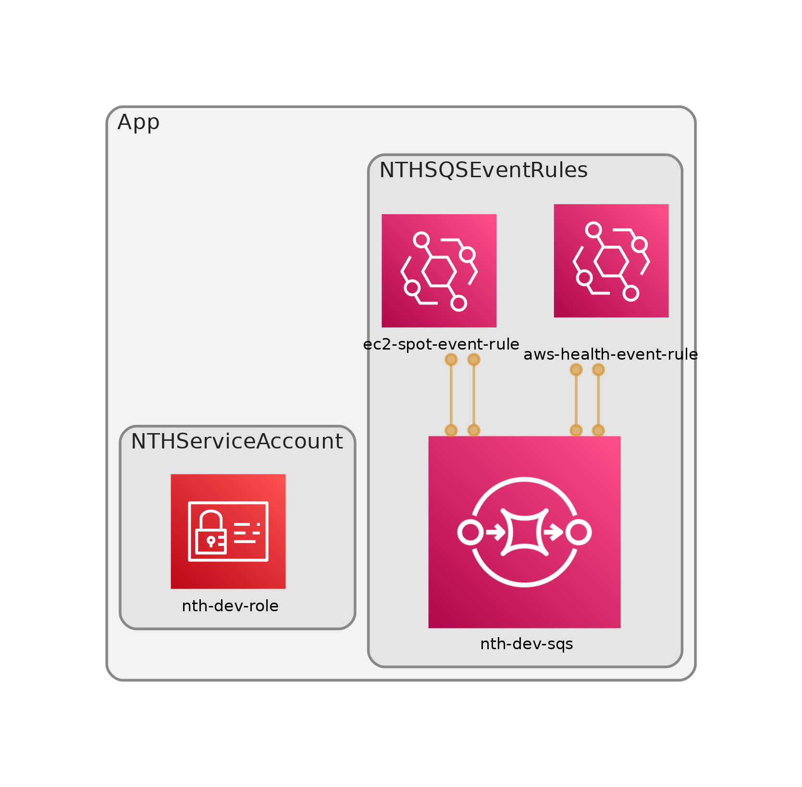
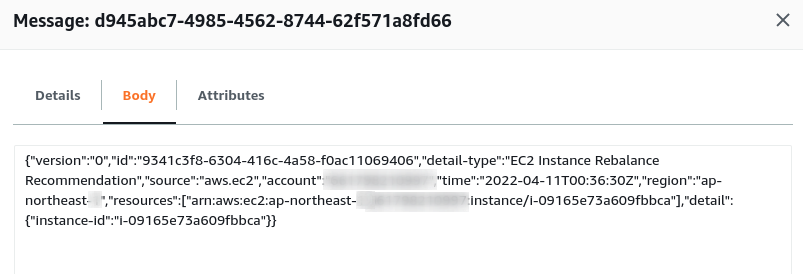
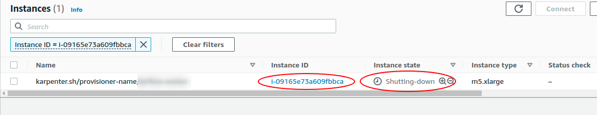

<p align="center">
  <a href="https://dev.to/vumdao">
    
  </a>
</p>
<h1 align="center">
  <div><b>Karpenter with AWS Node Termination Handler</b></div>
</h1>

## Abstract
- For using spot instnaces in karpenter provisioner, we need to know that Karpenter does not handle the Spot Interruption Termination Notice (ITN) two-minute warning. In lieu of this, AWS Node Termination Handler (NTH) is the solution to gracefully cordon and drain the spot nodes when they are interrupted.
- Pods that require checkpointing or other forms of graceful draining, requiring the 2-mins before shutdown, will need NTH.
- This post provides step-by-step to install NTH with SQS processor mode, provide AWS IAM permission for handler through IAM role for service account and test it.
- Note that this post mentions karpenter but not describe any about karpenter. However, the setting of NTH in this post suits to tools like Karpenter without using AutoScaling group (ASG)

## Table Of Contents
 * [Pre-requisite](#Pre-requisite)
 * [Create NTH serviceAccount](#Create-NTH-serviceAccount)
 * [Create SQS queue and event EventBridge rules](#Create-SQS-queue-and-event-EventBridge-rules)
 * [Install the AWS Node Termination Handler non-ASG](#Install-the-AWS-Node-Termination-Handler-non-ASG)
 * [Check NTH works well](#Check-NTH-works-well)
 * [Conclusion](#Conclusion)

---

## 🚀 **Pre-requisite** <a name="Pre-requisite"></a>
- EKS cluster
- IAM Instance profile which will be assigned to EKS nodes and help them to join the EKS cluster
- OIDC provider
- Karpenter provisioner with capicity-type `spot`

## 🚀 **Create NTH serviceAccount** <a name="Create-NTH-serviceAccount"></a>
- The best practice to provide AWS permission for Kubernetes service is [Using IAM Service Account Instead Of Instance Profile For EKS Pods](https://dev.to/vumdao/using-iam-service-account-instead-of-instance-profile-for-eks-pods-262p)
- If you already setup OIDC by using IAM identity provider then you can create the IAM role as service account for karpenter manually or using CDK.
- The role only needs permission to consume SQS messages, EC2 describe actions and autoscaling describe actions
  [`nth-sa.ts`](https://github.com/vumdao/karpenter-with-aws-node-termination-handler/blob/master/src/nth-sa.ts)
- Then generate service-account yaml base on the output IAM role ARN
- [`nth-sa.yaml`](https://github.com/vumdao/karpenter-with-aws-node-termination-handler/blob/master/yaml/nth-sa.yaml)
- Create service account by `kubectl apply -f nth-sa.yaml` and then check the result
    ```
    ⚡ $ kubectl get sa -n kube-system
    NAME                                 SECRETS   AGE
    aws-node-termination-handler         1         13m
    ```

## 🚀 **Create SQS queue and event EventBridge rules** <a name="Create-SQS-queue-and-event-EventBridge-rules"></a>
- The EventBridge rules send all events from spot instances such as `"EC2 Spot Instance Interruption Warning", "EC2 Instance Rebalance Recommendation", "EC2 Instance State-change Notification"` or `AWS Health Event` to the SQS target queue
- NTH handler listens to the SQS, process messages and then drain and/or cordon the corresponding node
- We can use CDK to create those AWS resources [`nth-sqs-rules.ts`](https://github.com/vumdao/karpenter-with-aws-node-termination-handler/blob/master/src/nth-sqs-rules.ts)
- See its diagram which is generated by [cdk-dia](https://github.com/pistazie/cdk-dia)

  

## 🚀 **Install the AWS Node Termination Handler non-ASG** <a name="Install-the-AWS-Node-Termination-Handler-non-ASG"></a>
- Custom helm chart value
  - Disable creating new serviceAccount and specify the `serviceAccount` we created above
  - Provide `queueURL` and `awsRegion`

  <details>
  <summary>nth-values.yaml</summary>

  ```
  enableSqsTerminationDraining: true
  queueURL: "https://sqs.ap-northeast-2.amazonaws.com/123456789012/nth-dev-sqs"
  awsRegion: "ap-northeast-2"
  serviceAccount:
    create: false
    name: aws-node-termination-handler
  checkASGTagBeforeDraining: false # <-- set to false as instances do not belong to any ASG
  assumeAsgTagPropagation: true # <-- mitigate the need of ASG IAM permission
  enableSpotInterruptionDraining: true
  ```
  </details>

- Install aws-node-termination-handler using helm chart
  ```
  ⚡ $ helm upgrade --install aws-node-termination-handler eks/aws-node-termination-handler -n kube-system --values yaml/nth-values.yaml
  Release "aws-node-termination-handler" does not exist. Installing it now.
  NAME: aws-node-termination-handler
  LAST DEPLOYED: Sun Apr 10 15:39:43 2022
  NAMESPACE: kube-system
  STATUS: deployed
  REVISION: 1
  TEST SUITE: None
  NOTES:
  ***********************************************************************
  * AWS Node Termination Handler                                        *
  ***********************************************************************
    Chart version: 0.18.0
    App version:   1.16.0
    Image tag:     public.ecr.aws/aws-ec2/aws-node-termination-handler:v1.16.0
    Mode :         Queue Processor
  ***********************************************************************

  ⚡ $ kubectl get pod -n kube-system -l app.kubernetes.io/name=aws-node-termination-handler
  NAME                                            READY   STATUS    RESTARTS   AGE
  aws-node-termination-handler-65b75b4896-74zqg   1/1     Running   0          95s
  ```

- Check the log to see if NTH can listen to the SQS queue
  ```
  kubectl logs -f --tail=100 -n kube-system aws-node-termination-handler-5889bcd797-h2sth
  2022/04/10 15:53:07 INF Starting to serve handler /healthz, port 8080
  2022/04/10 15:53:07 INF Started watching for interruption events
  2022/04/10 15:53:07 INF Kubernetes AWS Node Termination Handler has started successfully!
  2022/04/10 15:53:07 INF Started watching for event cancellations
  2022/04/10 15:53:07 INF Started monitoring for events event_type=SQS_TERMINATE
  ```

- Note that NTH is deployed on any nodes without taints even on the spot instance, so for best practice, the NTH deployment should be assigned to stateful node.

## 🚀 **Check NTH works well** <a name="Check-NTH-works-well"></a>
- How to know if NTH works well? We can use [EC2 Spot Interruptions - AWS Fault Injection Simulator
](https://dev.to/aws-builders/ec2-spot-interruptions-aws-fault-injection-simulator-31i2) to send `aws:ec2:send-spot-instance-interruptions` event and go to check if NTH is able to cordon the nodes and karpenter provides new node

  

- NTH logs
  ```
  2022/04/11 16:23:33 INF Adding new event to the event store event={"AutoScalingGroupName":"","Description":"Rebalance recommendation event received. Instance i-09165e73a609fbbca will be cordoned at 2022-04-11 16:23:33 +0000 UTC \n","EndTime":"0001-01-01T00:00:00Z","EventID":"rebalance-recommendation-event-33643432376337652d326234632d633063372d313138642d626231323834393963343761","InProgress":false,"InstanceID":"i-09165e73a609fbbca","IsManaged":true,"Kind":"SQS_TERMINATE","NodeLabels":null,"NodeName":"ip-172-10-51-198.ap-northeast-2.compute.internal","NodeProcessed":false,"Pods":null,"StartTime":"2022-04-11T16:23:33Z","State":""}
  2022/04/11 16:23:34 INF Requesting instance drain event-id=rebalance-recommendation-event-33643432376337652d326234632d633063372d313138642d626231323834393963343761 instance-id=i-09165e73a609fbbca kind=SQS_TERMINATE node-name=ip-172-10-51-198.ap-northeast-2.compute.internal
  2022/04/11 16:23:34 INF Draining the node
  2022/04/11 16:23:38 INF Node successfully cordoned and drained node_name=ip-172-10-51-198.ap-northeast-2.compute.internal reason="Spot Interruption event received. Instance i-09165e73a609fbbca will be interrupted at 2022-04-11 16:23:33 +0000 UTC \n"
  2022/04/11 16:23:38 INF Node successfully cordoned and drained node_name=ip-172-10-51-198.ap-northeast-2.compute.internal reason="Rebalance recommendation event received. Instance i-09165e73a609fbbca will be cordoned at 2022-04-11 16:23:33 +0000 UTC \n"
  ```

  ```
  # kf get node -l karpenter.sh/capacity-type=spot
  NAME                                               STATUS                     ROLES    AGE   VERSION
  ip-172-10-21-134.ap-northeast-2.compute.internal   Ready                      <none>   58s   v1.20.15
  ip-172-10-51-198.ap-northeast-2.compute.internal   Ready,SchedulingDisabled   <none>   10h   v1.20.15
  ip-172-10-51-44.ap-northeast-2.compute.internal    Ready                      <none>   10h   v1.20.15
  ip-172-10-51-7.ap-northeast-2.compute.internal     Ready                      <none>   10h   v1.20.15
  ```

  

## 🚀 **Conclusion** <a name="Conclusion"></a>
- Now we have node-termination-handler takes of spot interruption to ensure our services are gracefully rolling.
- But for services with long process such as data pipeline which are expensive to restart we should consider to use on-demand instances or

---

References:
- [Configure the Node Termination Handler to use queue processor mode](https://aws.github.io/aws-eks-best-practices/karpenter/#install-the-aws-node-termination-handler-when-using-spot)
- [aws-node-termination-handler](https://github.com/aws/aws-node-termination-handler)

---

<h3 align="center">
  <a href="https://dev.to/vumdao">:stars: Blog</a>
  <span> · </span>
  <a href="https://github.com/vumdao/karpenter-with-aws-node-termination-handler/">Github</a>
  <span> · </span>
  <a href="https://stackoverflow.com/users/11430272/vumdao">stackoverflow</a>
  <span> · </span>
  <a href="https://www.linkedin.com/in/vu-dao-9280ab43/">Linkedin</a>
  <span> · </span>
  <a href="https://www.linkedin.com/groups/12488649/">Group</a>
  <span> · </span>
  <a href="https://www.facebook.com/CloudOpz-104917804863956">Page</a>
  <span> · </span>
  <a href="https://twitter.com/VuDao81124667">Twitter :stars:</a>
</h3>
